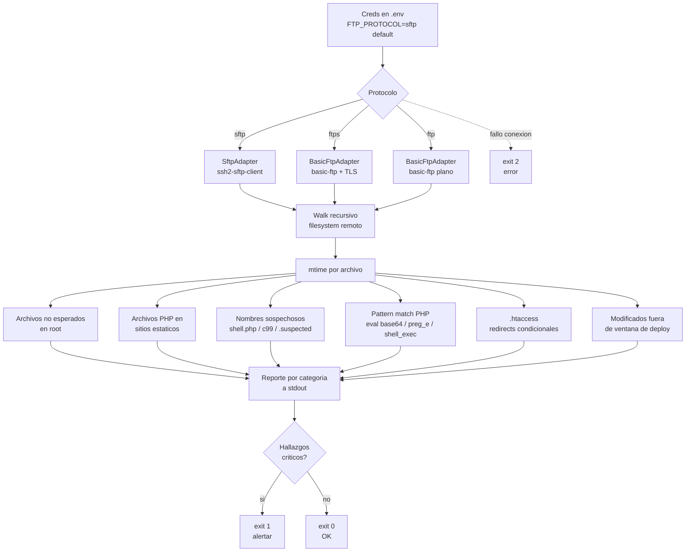

# ftp-audit

Auditoría read-only de un sitio web en hosting compartido. Soporta **SFTP**, **FTPS** y **FTP** plano. Detecta los vectores típicos de SEO injection, pharma hack, japanese keyword hack y backdoors PHP.

Pensado para pymes con sitios estáticos en hosting tipo cPanel/Plesk.

Read in English: [README.md](./README.md)

## Protocolos soportados

| Protocolo | Puerto default | Encriptación | Recomendado | Cuándo usar |
|---|---|---|---|---|
| **SFTP** (FTP sobre SSH) | 22 | SSH | ✅ sí | Default. Hosting moderno (cPanel, Plesk, DreamHost, SiteGround, A2, Hostinger). También soporta auth por private key. |
| **FTPS** (FTP sobre TLS) | 21 / 990 | TLS | ✅ sí | Hosting que da FTP "seguro" pero no SSH abierto. |
| **FTP** plano | 21 | ❌ ninguna | ⚠ último recurso | Hosting compartido low-cost que solo expone FTP plano. Las credenciales viajan en cleartext, correr solo desde redes confiables. |

Configurás el protocolo con `FTP_PROTOCOL=sftp | ftps | ftp` en `.env`. Default es `sftp`.

## Cómo funciona



Todo es READ-ONLY. No descarga al disco local, no modifica nada en el server. Lee a buffer en memoria, analiza y reporta.

## Resultados esperados

| Categoría | Hallazgo típico | Severidad | Acción sugerida |
|---|---|---|---|
| Archivos PHP en sitio estático | `contacto.php`, `mailer.php`, `wp-login.php` en sitio HTML puro | media | revisar contenido; legítimo si lo agregaste vos |
| Nombres sospechosos | `shell.php`, `c99.php`, `r57.php`, `*.suspected`, `.bak` | crítica | borrar y rotar credenciales |
| Patrones de backdoor en PHP | `eval(base64_decode(...))`, `assert($_POST[...])`, `preg_replace('/.../e')`, `system($_GET[...])` | crítica | eliminar archivo, scan completo de host |
| .htaccess con redirects condicionales | `RewriteCond` por `User-Agent` / `Referrer` / `Accept-Language` | media | revisar manualmente; legítimo si redirige por idioma, sospechoso si por googlebot |
| Archivos fuera del root esperado | `/public_html/seo/`, `/public_html/pgsoft/`, dominios pharma/casino | crítica | borrar y solicitar reindexación a Google |
| Archivos modificados fuera de ventana | Cualquier escritura sin deploy correspondiente en últimos 90 días | media | correlacionar con logs del hosting |

Exit codes para integrar con cron + alerter:

| Code | Significado |
|---|---|
| `0` | Sin hallazgos críticos |
| `1` | Encontró PHP con patrones de hack o nombres sospechosos |
| `2` | Error fatal de conexión |

## Cuándo usarlo

- Después de detectar resultados raros en `site:tudominio.com` en Google
- Como chequeo periódico (cron semanal con alerter por email)
- Antes de tomar un proyecto heredado, para saber qué hay
- Después de un incidente, para confirmar que el filesystem quedó limpio

## Setup

```bash
git clone https://github.com/sarteta/ftp-audit.git
cd ftp-audit
npm install
cp .env.example .env
# editá .env con tu protocolo y credenciales
node ftp-audit.js
```

## Configuración (`.env`)

Mínimo para SFTP (recomendado):

```
FTP_PROTOCOL=sftp
FTP_HOST=tu-host.example.com
FTP_USER=tu-usuario
FTP_PASS=tu-password
FTP_PATH=/public_html
```

Mínimo para FTPS:

```
FTP_PROTOCOL=ftps
FTP_HOST=tu-host.example.com
FTP_USER=tu-usuario
FTP_PASS=tu-password
FTP_PATH=/public_html
```

Mínimo para FTP plano (no recomendado, solo redes confiables):

```
FTP_PROTOCOL=ftp
FTP_HOST=tu-host.example.com
FTP_USER=tu-usuario
FTP_PASS=tu-password
FTP_PATH=/public_html
```

### Auth por private key (solo SFTP)

Si tu hosting permite SSH key, podés usar key en lugar de password:

```
FTP_PROTOCOL=sftp
FTP_HOST=tu-host.example.com
FTP_USER=tu-usuario
SFTP_KEY_PATH=/home/usuario/.ssh/id_rsa
SFTP_KEY_PASSPHRASE=
FTP_PATH=/public_html
```

Si seteás `SFTP_KEY_PATH`, `FTP_PASS` se ignora.

### Whitelist de root (`EXPECTED_ROOT`)

```
EXPECTED_ROOT=index.html,index.php,robots.txt,sitemap.xml,favicon.ico,.htaccess,css,js,img,images,assets,fonts
```

Cualquier archivo o carpeta en el root que no esté en esta lista se reporta como sospechoso. Personalizalo según tu sitio.

## Salida

```
========================================
RESUMEN
========================================
Protocolo        : SFTP
Archivos totales : 89
Directorios      : 6
Bytes totales    : 37.25 MB

========================================
ARCHIVOS NO ESPERADOS EN ROOT
========================================
  [FILE] /public_html/contacto.php  2322B
  [DIR]  /public_html/folletos
  [DIR]  /public_html/fonts

========================================
NOMBRES SOSPECHOSOS
========================================
  (ninguno) OK

========================================
ARCHIVOS PHP
========================================
  /public_html/contacto.php  2322B

========================================
PHP CON PATRONES DE HACK
========================================
  (ninguno) OK

========================================
.htaccess (revisar redirects condicionales)
========================================
<IfModule mod_rewrite.c>
    RewriteCond %{HTTPS} off
    RewriteRule (.*) https://example.com/$1 [R=301,L,QSA]
</IfModule>
```

Útil para dejarlo en cron y enganchar con un alerter:

```bash
0 4 * * 0  cd /opt/ftp-audit && node ftp-audit.js > /var/log/ftp-audit.log 2>&1 || mail -s "FTP audit FAIL" admin@example.com < /var/log/ftp-audit.log
```

## Limitaciones

- No detecta hacks que viven 100% fuera del filesystem (DB injections, malicious cron, registros DNS comprometidos)
- No detecta cloaking si el servidor solo se compromete cuando ve User-Agent específico. Para eso probar `curl -A "Googlebot" tudominio.com` y comparar con `curl tudominio.com`
- Whitelist de nombres sospechosos es heurística, hay falsos positivos. Revisar cada match con criterio
- El pattern matching de PHP detecta los backdoors clásicos, no obfuscados con técnicas custom
- Para sitios muy grandes (>5000 archivos) puede tardar varios minutos. Ajustar `maxDepth` en el código si tu árbol es muy profundo

Si el script dice "todo limpio" y aun así sospechás del sitio:

1. Probar `curl -A "Googlebot" tudominio.com` y comparar con `curl tudominio.com`. Si difieren, hay cloaking
2. Buscar en Google `site:tudominio.com` y revisar los titles indexados
3. Mirar los logs de acceso del servidor por requests raros a paths que no existen

## Licencia

MIT
