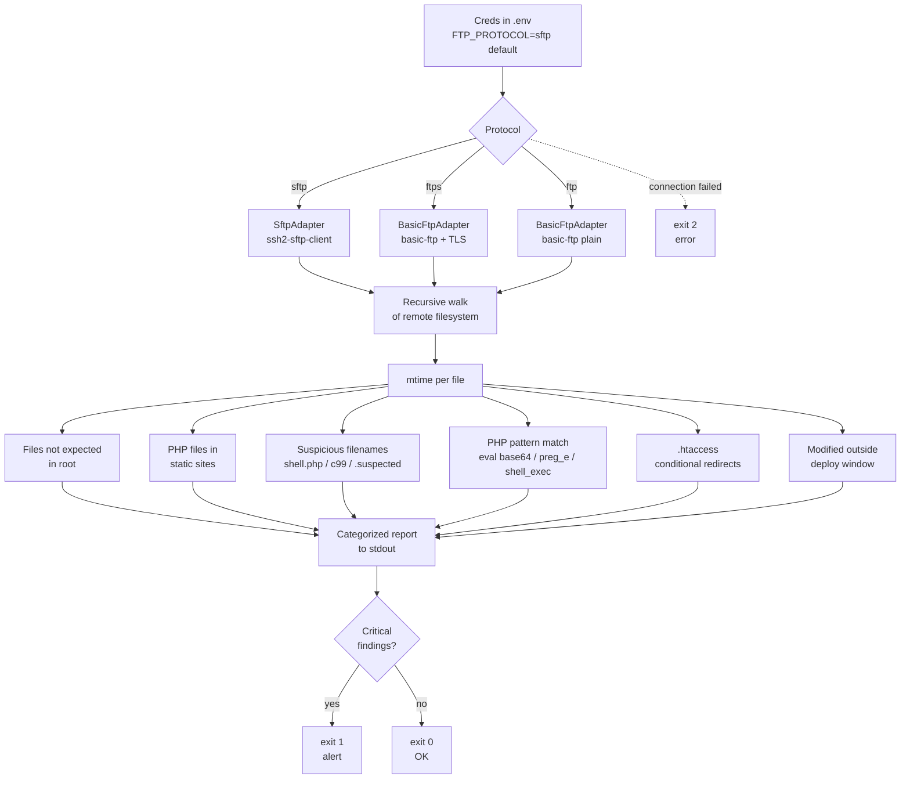

# ftp-audit

Read-only audit of a website served from shared hosting. Supports **SFTP**, **FTPS**, and plain **FTP**. Detects common SEO-injection, pharma-hack, japanese-keyword-hack vectors and PHP backdoors.

Aimed at small businesses with static sites on cPanel/Plesk-style shared hosting.

Lectura en español: [README.es.md](./README.es.md)

## Supported protocols

| Protocol | Default port | Encryption | Recommended | When to use |
|---|---|---|---|---|
| **SFTP** (FTP over SSH) | 22 | SSH | yes | Default. Modern shared hosting (cPanel, Plesk, DreamHost, SiteGround, A2, Hostinger). Also supports private-key auth. |
| **FTPS** (FTP over TLS) | 21 / 990 | TLS | yes | Hosting that exposes "secure" FTP but does not allow SSH. |
| **FTP** plain | 21 | none | last resort | Cheap shared hosting that only exposes plain FTP. Credentials travel in cleartext, only run from trusted networks. |

Set the protocol with `FTP_PROTOCOL=sftp | ftps | ftp` in `.env`. Default is `sftp`.

## How it works



Everything is READ-ONLY. No downloads to local disk, no writes to the server. The script reads file content into memory buffers, analyzes, and reports.

## Expected findings

| Category | Typical hit | Severity | Suggested action |
|---|---|---|---|
| PHP file in a static site | `contacto.php`, `mailer.php`, `wp-login.php` in pure-HTML site | medium | review content; legitimate if you added it |
| Suspicious filename | `shell.php`, `c99.php`, `r57.php`, `*.suspected`, `.bak` | critical | delete and rotate credentials |
| PHP backdoor pattern | `eval(base64_decode(...))`, `assert($_POST[...])`, `preg_replace('/.../e')`, `system($_GET[...])` | critical | delete file, full host scan |
| `.htaccess` with conditional redirect | `RewriteCond` by `User-Agent` / `Referrer` / `Accept-Language` | medium | manual review; legitimate for language redirects, suspicious if keyed on Googlebot |
| File outside expected root | `/public_html/seo/`, `/public_html/pgsoft/`, pharma/casino domains | critical | delete and request reindex from Google |
| File modified outside deploy window | Any write in last 90 days without a corresponding deploy | medium | correlate with hosting access logs |

Exit codes for cron + alerter integration:

| Code | Meaning |
|---|---|
| `0` | No critical findings |
| `1` | PHP with hack patterns or suspicious names found |
| `2` | Fatal connection error |

## When to run it

- After noticing odd results in a `site:yourdomain.com` Google search
- As a periodic check (weekly cron with email alerter)
- Before taking over an inherited project, to know what is on the server
- After an incident, to confirm the filesystem is clean

## Setup

```bash
git clone https://github.com/sarteta/ftp-audit.git
cd ftp-audit
npm install
cp .env.example .env
# fill in your protocol and credentials
node ftp-audit.js
```

## Configuration (`.env`)

Minimum config for SFTP (recommended):

```
FTP_PROTOCOL=sftp
FTP_HOST=your-host.example.com
FTP_USER=your-username
FTP_PASS=your-password
FTP_PATH=/public_html
```

Minimum config for FTPS:

```
FTP_PROTOCOL=ftps
FTP_HOST=your-host.example.com
FTP_USER=your-username
FTP_PASS=your-password
FTP_PATH=/public_html
```

Minimum config for plain FTP (not recommended, only on trusted networks):

```
FTP_PROTOCOL=ftp
FTP_HOST=your-host.example.com
FTP_USER=your-username
FTP_PASS=your-password
FTP_PATH=/public_html
```

### Private-key auth (SFTP only)

If your hosting allows SSH key auth, you can use a key instead of a password:

```
FTP_PROTOCOL=sftp
FTP_HOST=your-host.example.com
FTP_USER=your-username
SFTP_KEY_PATH=/home/user/.ssh/id_rsa
SFTP_KEY_PASSPHRASE=
FTP_PATH=/public_html
```

If `SFTP_KEY_PATH` is set, `FTP_PASS` is ignored.

### Root whitelist (`EXPECTED_ROOT`)

```
EXPECTED_ROOT=index.html,index.php,robots.txt,sitemap.xml,favicon.ico,.htaccess,css,js,img,images,assets,fonts
```

Any file or folder in the root that is not in this list is reported as suspicious. Customize for your site.

## Sample output

```
========================================
SUMMARY
========================================
Protocol         : SFTP
Total files      : 89
Directories      : 6
Total bytes      : 37.25 MB

========================================
UNEXPECTED FILES IN ROOT
========================================
  [FILE] /public_html/contacto.php  2322B
  [DIR]  /public_html/folletos
  [DIR]  /public_html/fonts

========================================
SUSPICIOUS NAMES
========================================
  (none) OK

========================================
PHP FILES
========================================
  /public_html/contacto.php  2322B

========================================
PHP WITH HACK PATTERNS
========================================
  (none) OK

========================================
.htaccess (review for conditional redirects)
========================================
<IfModule mod_rewrite.c>
    RewriteCond %{HTTPS} off
    RewriteRule (.*) https://example.com/$1 [R=301,L,QSA]
</IfModule>
```

Useful as a cron + alerter:

```bash
0 4 * * 0  cd /opt/ftp-audit && node ftp-audit.js > /var/log/ftp-audit.log 2>&1 || mail -s "FTP audit FAIL" admin@example.com < /var/log/ftp-audit.log
```

## Tests

```bash
npm test
```

Runs 10 detection cases against synthetic backdoor samples in `tests/samples/`. Verifies that each PHP hack pattern matches what it claims to match, and explicitly demonstrates two known evasion techniques the simple regex cannot catch (string-concatenation obfuscation, variable indirection between user input and the dangerous call).

## Limitations

The detection layer is a regex scanner over PHP source. It catches the unobfuscated payloads that automated mass-injection campaigns use, which covers most threats hitting cheap shared hosting. It does NOT catch:

- Backdoors with custom obfuscation, charcode encoding, or polymorphic mutation
- Indirect call chains where user input is assigned to a variable before being passed to a dangerous function (proven in `tests/samples/backdoor-mail-indirect-evasion.php`)
- Backdoors hidden in non-PHP extensions (image polyglots, `.htaccess` PHP execution rules pointing at innocent-looking files)
- Hacks that live entirely outside the filesystem (DB injections, malicious cron, hijacked DNS)
- Cloaking that only triggers for specific User-Agents. Test with `curl -A "Googlebot" yourdomain.com` and compare to a normal `curl yourdomain.com`
- Recently-active backdoors that have already self-deleted after running

For high-value sites that face targeted attacks, this is not enough on its own. Run it as a fast first-pass and complement with a real malware scanner (Sucuri, Wordfence for WordPress, ImunifyAV server-side, ClamAV with PHP signatures).

If the script reports clean and you still suspect compromise:

1. Run `curl -A "Googlebot" yourdomain.com` and compare with a normal `curl yourdomain.com`. Different output means cloaking
2. Search Google `site:yourdomain.com` and check what titles are indexed
3. Check the hosting access logs for requests to paths that should not exist

## License

MIT
