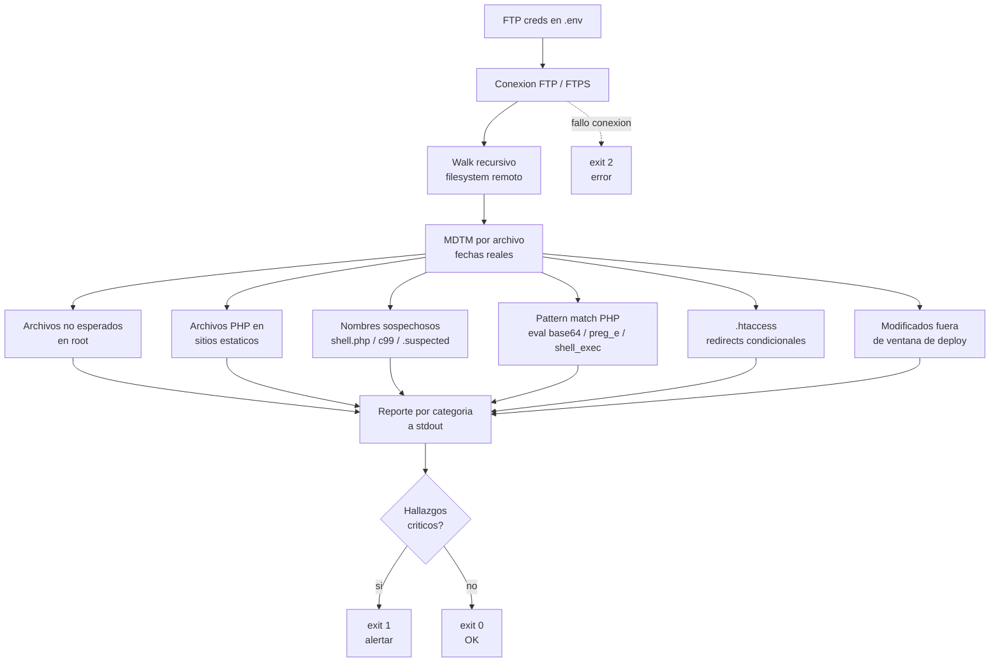

# ftp-audit

Auditoría read-only de un sitio web en hosting compartido vía FTP. Detecta los vectores típicos de SEO injection, pharma hack, japanese keyword hack y backdoors PHP.

Pensado para pymes con sitios estáticos en hosting tipo cPanel/Plesk donde no hay SSH, solo FTP.

## Cómo funciona



Todo es READ-ONLY. No descarga al disco local, no modifica nada en el server. Lee a buffer en memoria, analiza y reporta.

## Resultados esperados

| Categoría | Hallazgo típico | Severidad | Acción sugerida |
|---|---|---|---|
| Archivos PHP en sitio estático | `contacto.php`, `mailer.php`, `wp-login.php` en sitio HTML puro | media | revisar contenido; legítimo si lo agregaste vos |
| Nombres sospechosos | `shell.php`, `c99.php`, `r57.php`, `*.suspected`, `.bak` | crítica | borrar y rotar credenciales FTP |
| Patrones de backdoor en PHP | `eval(base64_decode(...))`, `assert($_POST[...])`, `preg_replace('/.../e')`, `system($_GET[...])` | crítica | eliminar archivo, scan completo de host |
| .htaccess con redirects condicionales | `RewriteCond` por `User-Agent` / `Referrer` / `Accept-Language` | media | revisar manualmente; legítimo si redirige por idioma, sospechoso si por googlebot |
| Archivos fuera del root esperado | `/public_html/seo/`, `/public_html/pgsoft/`, dominios pharma/casino | crítica | borrar y solicitar reindexación a Google |
| Archivos modificados fuera de ventana | Cualquier escritura sin deploy correspondiente en últimos 7 días | media | correlacionar con logs de FTP del hosting |

Exit codes para integrar con cron + alerter:

| Code | Significado |
|---|---|
| `0` | Sin hallazgos críticos |
| `1` | Encontró PHP con patrones de hack o nombres sospechosos |
| `2` | Error fatal de conexión |

## Cuándo usarlo

- Después de detectar resultados raros en `site:tudominio.com` en Google
- Como chequeo periódico (cron semanal con alerter por email)
- Antes de tomar un proyecto heredado, para saber qué hay
- Después de un incidente, para confirmar que el filesystem quedó limpio

## Setup

```bash
git clone https://github.com/sarteta/ftp-audit.git
cd ftp-audit
npm install
cp .env.example .env
# editá .env con tus credenciales FTP
node ftp-audit.js
```

## Configuración (`.env`)

```
FTP_HOST=tu-host.example.com
FTP_USER=tu-usuario
FTP_PASS=tu-password
FTP_PATH=/public_html
FTP_PORT=21
FTP_SECURE=false
EXPECTED_ROOT=index.html,index.php,robots.txt,sitemap.xml,favicon.ico,.htaccess,css,js,img,images,assets,fonts
```

`EXPECTED_ROOT` es la whitelist de archivos/carpetas que tu sitio sí debería tener en root. Cualquier cosa fuera de esa lista se reporta como sospechosa. Personalizalo según tu sitio.

Si tu hosting soporta FTPS (FTP sobre TLS), poné `FTP_SECURE=true`. Si soporta SFTP de verdad, mejor cambiate a un script con `ssh2-sftp-client`. Este script asume FTP plano porque es lo más común en hosting compartido low-cost.

## Salida

```
========================================
RESUMEN
========================================
Archivos totales : 89
Directorios      : 6
Bytes totales    : 37.25 MB

========================================
ARCHIVOS NO ESPERADOS EN ROOT
========================================
  [FILE] /public_html/contacto.php  2322B
  [DIR]  /public_html/folletos
  [DIR]  /public_html/fonts

========================================
NOMBRES SOSPECHOSOS
========================================
  (ninguno) OK

========================================
ARCHIVOS PHP
========================================
  /public_html/contacto.php  2322B

========================================
PHP CON PATRONES DE HACK
========================================
  (ninguno) OK

========================================
.htaccess (revisar redirects condicionales)
========================================
<IfModule mod_rewrite.c>
    RewriteCond %{HTTPS} off
    RewriteRule (.*) https://example.com/$1 [R=301,L,QSA]
</IfModule>
```

Útil para dejarlo en cron y enganchar con un alerter:

```bash
0 4 * * 0  cd /opt/ftp-audit && node ftp-audit.js > /var/log/ftp-audit.log 2>&1 || mail -s "FTP audit FAIL" admin@example.com < /var/log/ftp-audit.log
```

## Limitaciones

- No detecta hacks que viven 100% fuera del filesystem (DB injections, malicious cron, registros DNS comprometidos)
- No detecta cloaking si el servidor solo se compromete cuando ve User-Agent específico. Para eso probar `curl -A "Googlebot" tudominio.com` y comparar con `curl tudominio.com`
- Whitelist de nombres sospechosos es heurística, hay falsos positivos. Revisar cada match con criterio
- El pattern matching de PHP detecta los backdoors clásicos, no los obfuscados con técnicas custom

Si el script dice "todo limpio" y aun así sospechás del sitio:

1. Probar `curl -A "Googlebot" tudominio.com` y comparar con `curl tudominio.com`. Si difieren, hay cloaking
2. Buscar en Google `site:tudominio.com` y revisar los titles indexados
3. Mirar los logs de acceso del servidor por requests raros a paths que no existen

## Licencia

MIT
